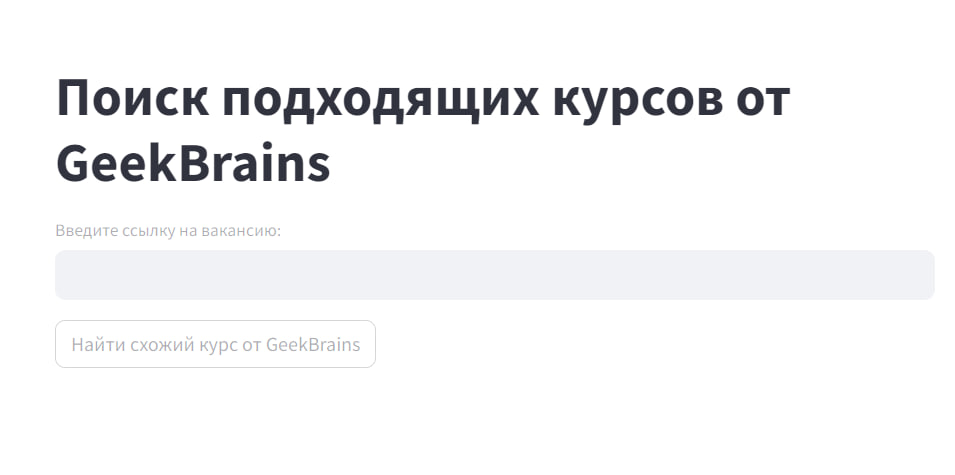

<p align="center">
      <br/>
     <H2 align="center">Команда Ikanam</H2> 
    <H2 align="center">Кейс "Компетентностный подбор образовательных курсов"</H2> 
</p>


> Команда Ikanam представляет жюри инновационный программный модуль с использованием ИИ для нахождения наиболее релевантных образовательных курсов GeekBrains на основе представленной вакансии с сайта HH.ru. Данный программный продукт является мощным инструментом для автоматизации анализа и улучшения качества пользовательского опыта.


## Установка и запуск

**Наше решение разделено на две ключевые части. Первая часть включает в себя подробное руководство по развёртыванию без необходимости взаимодействия с интерфейсом, что обеспечивает быстрое и эффективное тестирование. Вторая часть предоставляет подробные инструкции по развертыванию решения с использованием интерфейса, обеспечивая при этом максимальную удобство и интуитивную навигацию.**

***Часть 1:***
----------

*1. Загрузите репозиторий на свой компьютер и откройте её в вашей предпочитаемой среде разработки (IDE).* 

*2. Откройте терминал в IDE и введите туда следующую команду:* 

```python
python -m venv .venv
```
*3. Дождитесь создание папки `.venv` затем введите следующую команду:*

```python
.\.venv\Scripts\activate
```
*4. После активации установите все библиотеки (весрия python==3.10+) при помощи данной команды:*

```python
pip install -r requirements.txt
```

*5. Дождитесь установки всех библиотек и введите следующую команду.*

```python
pip install parse_hh_data==0.1.14
```

*6. Прекрасно! Теперь в терминале введите команду для перехода к основной папке с кодом проекта.*

```shell
cd src 
```

*7. Для запуска сервиса, введите следующую команду.*

```python
streamlit run src/app.py
```


<p align="center">
      <br/>
    Начальная страница сервиса
</p>


# Пример использования сервиса, иллюстрированный процессом обработки скринкаста.


https://github.com/ikanam-ai/VacancySkillsEstimator/assets/148991752/4a63bb7b-a88e-4027-b3af-a2ea32eec569


# Пример работы сервиса

***Часть 1:***

<p align="center">
      <br/>
    Поиск образовательных курсов по представленным данным
</p>

***Часть 2:***

<p align="center">
      <br/>
    Найденные схожие образовательные курсы
</p>

***Часть 3:***

<p align="center">
      <br/>
    Следующие по степени схожести образовательные курсы
</p>

***Часть 4:***
**Важно: Процесс немного долгий из-за нагрузки на сервер. Пожалуйста, подождите несколько минут. (Постарайтесь ничего не нажимать в текстовой области**


<p align="center">
      <br/>
    Анализ покрытия требований данной вакансии с помощью других образовательных курсов
</p>
